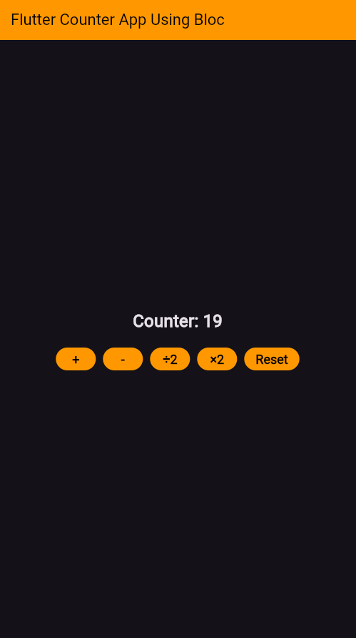

# 📱 Flutter Counter App using BLoC

A clean and professional counter app built with **Flutter** and **BLoC** state management. This project follows best practices, including a modular structure  and responsive UI.

## 📸 Screenshot


## 🚀 Features
- **State Management:** Uses Flutter **BLoC** for efficient state handling.
- **Basic Operations:** Supports Increment, Decrement, Multiply, Divide, and Reset.
- **Clean Architecture:** Well-structured with a separation of concerns.
- **Responsive UI:** Uses `Wrap` for adaptive button layout.

## 📂 Project Structure
```
flutter_counter_app_using_bloc/
 ┣ 📂 assets/
 ┃ ┗ 📂 screenshots/
 ┃   ┗ counter_app_result.png
 ┣ 📂 lib/
 ┃ ┣ 📂 business_logic/
 ┃ ┃ ┗ 📂 bloc/
 ┃ ┃   ┣ counter_bloc.dart
 ┃ ┃   ┣ counter_event.dart
 ┃ ┃   ┗ counter_state.dart
 ┃ ┣ 📂 presentation/
 ┃ ┃ ┗ 📂 screens/
 ┃ ┃   ┗ counter_screen.dart
 ┃ ┣ main.dart
 ┣ 📜 pubspec.yaml
 ┣ 📜 README.md
```

## 🛠 Installation
1. **Clone the Repository:**
   ```sh
   git clone https://github.com/azam-izm/flutter_counter_app_using_bloc.git
   cd flutter_counter_app_using_bloc
   ```
2. **Install Dependencies:**
   ```sh
   flutter pub get
   ```
3. **Run the App:**
   ```sh
   flutter run
   ```

## 🏗 Built With
- **Flutter** - UI framework
- **Flutter BLoC** - State management

## 📜 License
This project is open-source and available under the [MIT License](LICENSE).

---
Feel free to ⭐ the repo if you find it useful! 🚀
